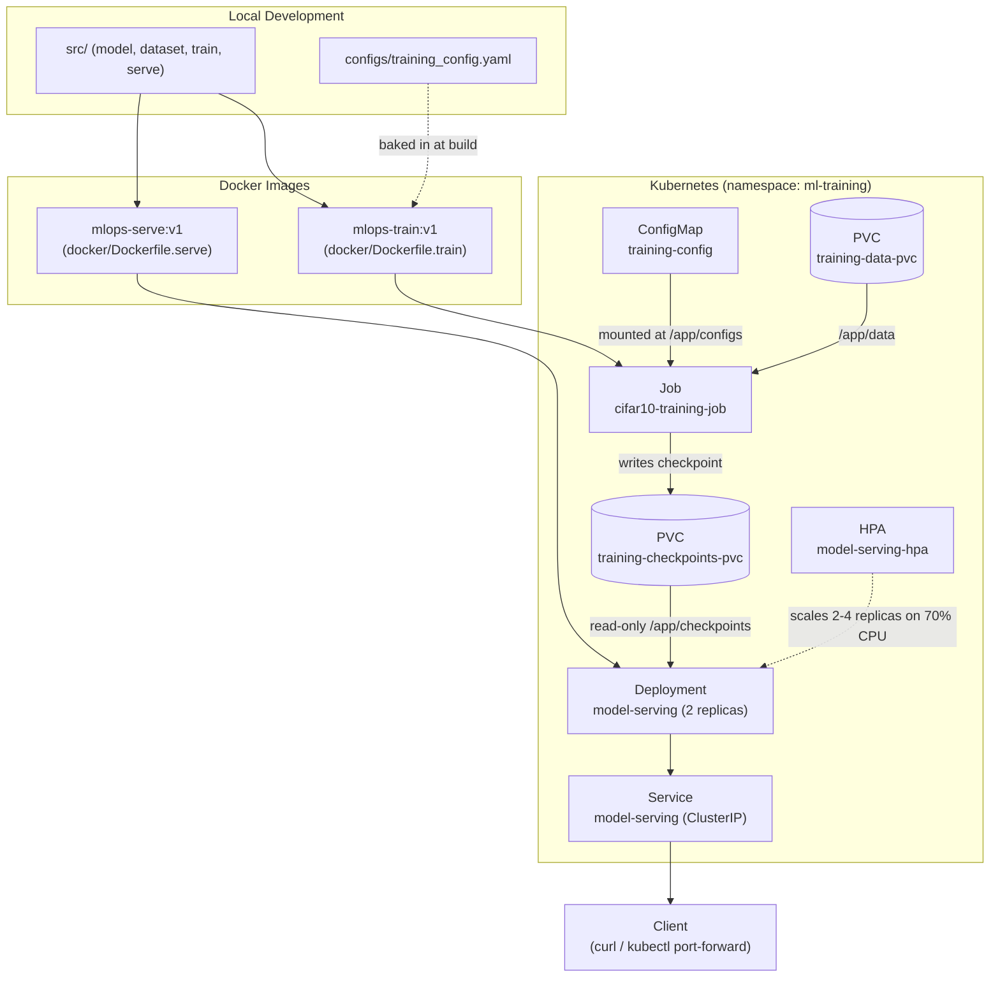

# mlops-pytorch-pipeline

A PyTorch image classification pipeline taken through the full MLOps lifecycle: local development, containerized training with Docker, and orchestrated training + serving on Kubernetes.

Built for the *MLOps & Infrastructure for Machine Learning* course assignment (Assignment 2: Deploying PyTorch ML Workloads with Docker & Kubernetes).

## Architecture



**Flow:** the training `Job` reads its hyperparameters from a `ConfigMap` (mounted at `/app/configs`), pulls CIFAR-10 from a `PersistentVolumeClaim` (`/app/data`), trains with early stopping, and writes a checkpoint to a second `PersistentVolumeClaim` (`/app/checkpoints`). The serving `Deployment` mounts that same checkpoints PVC read-only, exposing `/predict` and `/health` behind a `Service`, with an `HorizontalPodAutoscaler` watching CPU load.

## Project structure

```
mlops-pytorch-pipeline/
├── src/                  # model.py, dataset.py, train.py, serve.py
├── configs/              # training_config.yaml (hyperparameters)
├── docker/               # Dockerfile.train, Dockerfile.serve (multi-stage)
├── k8s/                  # namespace, configmap, training-job, serving-deployment,
│                         # serving-service, hpa
├── requirements/         # train.txt, serve.txt (pinned dependencies)
├── tests/                # test_model.py (pytest unit tests)
└── .github/workflows/    # ci.yml (runs pytest on push/PR)
```

## Prerequisites

- Python 3.10+ with `pip`
- Docker Desktop (with Kubernetes enabled — Kubeadm cluster type recommended so locally built images are immediately usable without a separate registry push or image-load step)
- `kubectl`

## Local development

Install dependencies (CPU build, avoids a large CUDA download):

```
pip install torch torchvision --index-url https://download.pytorch.org/whl/cpu
pip install flask pillow pyyaml pytest
```

Run the unit tests:

```
pytest tests/ -v
```

Run a quick local training smoke test (uses a local-only config override, not committed):

```
$env:TRAINING_CONFIG_PATH="configs/training_config.local.yaml"
$env:SMOKE_TEST_MAX_BATCHES="5"
python src/train.py
```

Run the serving API locally:

```
$env:CHECKPOINT_PATH="checkpoints/smoke_test.pt"
python src/serve.py
```

Then, in another terminal:

```
curl.exe http://localhost:8080/health
curl.exe -X POST http://localhost:8080/predict -F "image=@test_image.png"
```

## Docker

Build and run the training image (mounts local `data/` and `checkpoints/` folders):

```
docker build -f docker/Dockerfile.train -t mlops-train:v1 .
docker run --rm -v "${PWD}\data:/app/data" -v "${PWD}\checkpoints:/app/checkpoints" mlops-train:v1
```

Build and run the serving image:

```
docker build -f docker/Dockerfile.serve -t mlops-serve:v1 .
docker run --rm -d --name mlops-serve -p 8080:8080 -v "${PWD}\checkpoints:/app/checkpoints" mlops-serve:v1
curl.exe http://localhost:8080/health
curl.exe -X POST http://localhost:8080/predict -F "image=@test_image.png"
docker stop mlops-serve
```

## Kubernetes

Apply the training layer and wait for it to complete:

```
kubectl apply -f k8s/namespace.yaml
kubectl apply -f k8s/configmap.yaml
kubectl apply -f k8s/training-job.yaml
kubectl wait --for=condition=complete job/cifar10-training-job -n ml-training --timeout=300s
kubectl logs job/cifar10-training-job -n ml-training
```

Once training has produced a checkpoint, deploy the serving layer:

```
kubectl apply -f k8s/serving-deployment.yaml
kubectl apply -f k8s/serving-service.yaml
kubectl apply -f k8s/hpa.yaml
kubectl get pods -n ml-training
kubectl describe deployment model-serving -n ml-training
```

Test the live prediction endpoint via port-forward:

```
kubectl port-forward svc/model-serving 8080:80 -n ml-training
```

In another terminal:

```
curl.exe http://localhost:8080/health
curl.exe -X POST http://localhost:8080/predict -F "image=@test_image.png"
```

## Design notes

- **Config resolution** (`src/train.py`): checks a `TRAINING_CONFIG_PATH` env var, then a mounted `/app/configs/training_config.yaml` (how the Kubernetes ConfigMap is injected), then falls back to the repo's own `configs/training_config.yaml` baked into the image.
- **`SMOKE_TEST_MAX_BATCHES`**: an optional env var that caps batches per epoch, used only for fast pipeline verification (local, Docker, and the Kubernetes Job). Unset, training runs at full scale (10 epochs, full CIFAR-10).
- **Model architecture** (`src/model.py`): ResNet-18 is trained from scratch (`weights=None`) rather than fine-tuned from pretrained ImageNet weights, so training doesn't depend on internet access from inside a container/pod. The stem is adapted for 32x32 inputs (3x3 stride-1 conv, no initial maxpool).
- **GPU bonus**: not enabled. This was developed and tested entirely on a CPU-only machine, so there was no way to verify GPU scheduling locally without a hosted GPU node, which was out of scope. The Job manifest (`k8s/training-job.yaml`) includes a commented-out `nvidia.com/gpu` resource request plus a matching node selector/toleration, ready to enable on a GPU-equipped cluster.
- **Local dev vs. container paths**: `configs/training_config.local.yaml` (gitignored) overrides the container-oriented default config with local paths and the lightweight CNN architecture, for fast iteration without Docker/Kubernetes.

## Git workflow

- `main` — production branch, updated via periodic `develop → main` pull requests at milestones
- `develop` — integration branch, created from `main`
- `feature/*` — one branch per unit of work, merged into `develop` via PR with a descriptive summary

## CI

`.github/workflows/ci.yml` runs on every push/PR to `main` and `develop`: installs dependencies and runs the `pytest` suite in `tests/`.

## AI Assistance

Portions of the code in this repository were written with the help of an LLM. Every AI-suggested change was reviewed, tested against the actual command output described in this README (local runs, Docker builds, and the live Kubernetes cluster), and is understood well enough.


